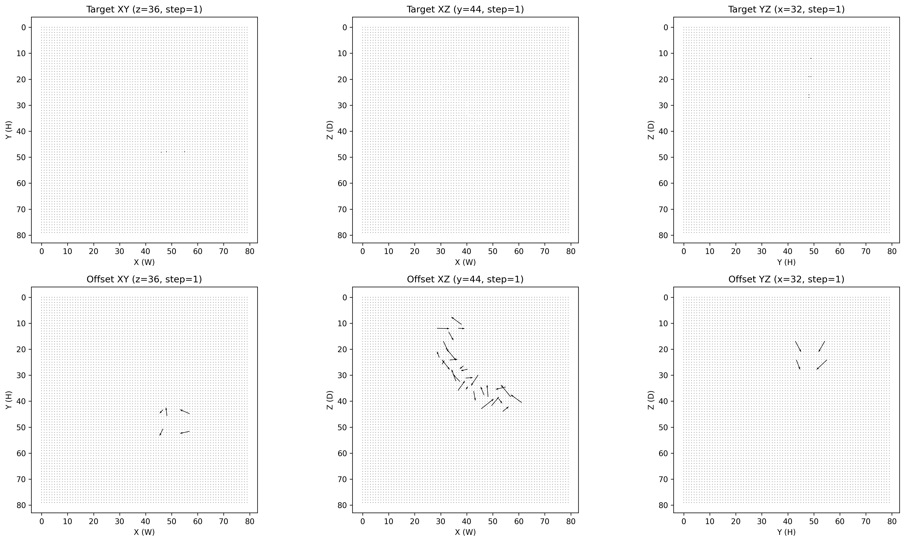
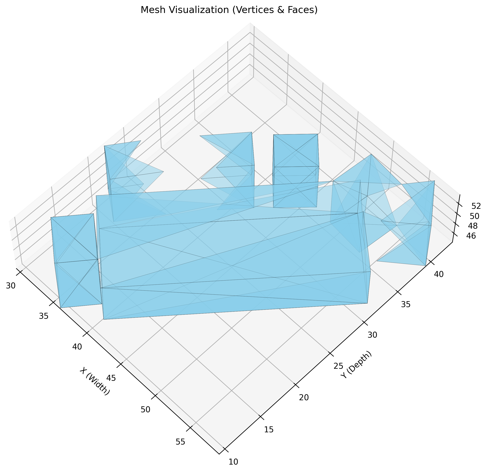
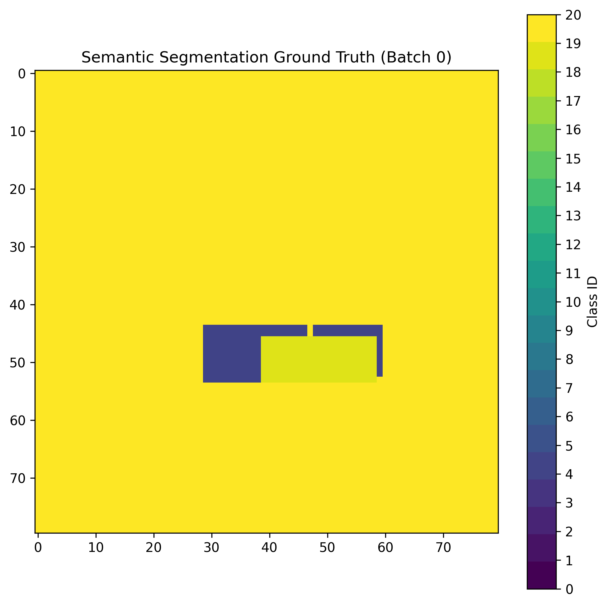
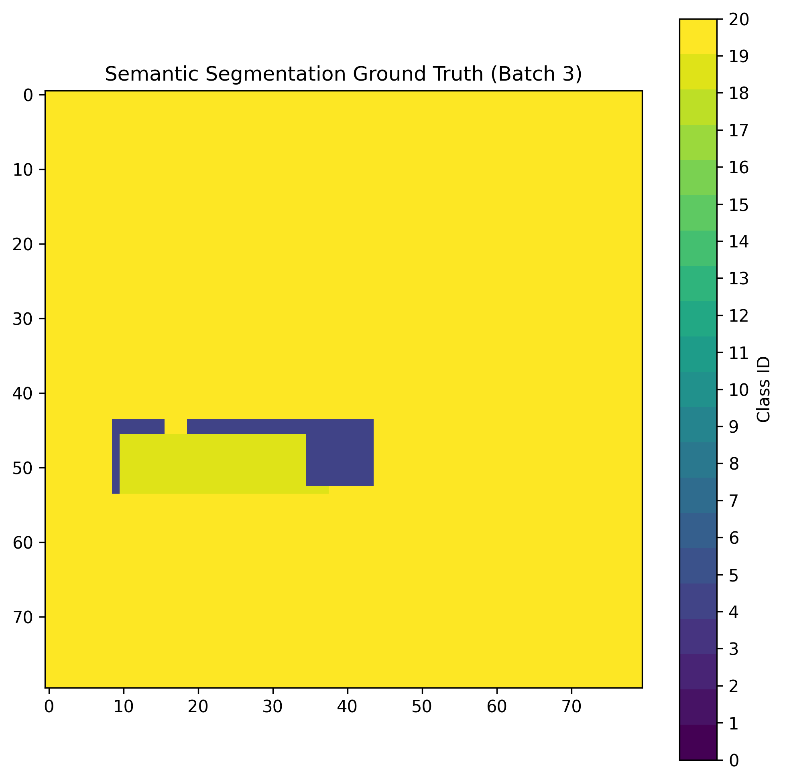

# [FailedProject]DeCoMesh — 疎な3Dベクトル場による単一画像からの高速メッシュ再構築

**単一のRGB画像から3Dメッシュ（頂点＋辺＋面）を直接復元する研究プロジェクト。**
ボクセル占有表現に頼らず、3D格子上に疎に配置した2種類のベクトル場（**Edge–Offset Vector Field**）としてメッシュ構造を符号化し、幾何的な後処理のみでメッシュへの復元を目指したものです。復元処理は 1シーンあたり約30msで動作しますが、実際には精度は0%で研究としては失敗に終わりました。

物体検出フレームワーク [YOLOX (Megvii)](https://github.com/Megvii-BaseDetection/YOLOX) をベースに、3D再構築タスク向けにモデル・損失関数・データローダ・評価指標を独自に実装・拡張したものです。

<div align="center">
  <br>
  <sub>三面図（xy / yz / zx）上に投影した Offset / Target ベクトル場の可視化</sub>
</div>

---

## 目次

- [開発の背景・目的](#開発の背景目的)
- [提案手法の概要](#提案手法の概要)
- [使用技術](#使用技術)
- [主な機能・実装したこと](#主な機能実装したこと)
- [こだわったポイント・工夫した点](#こだわったポイント工夫した点)
- [実験結果と考察](#実験結果と考察)
- [ローカルでの環境構築・起動手順](#ローカルでの環境構築起動手順)
- [ディレクトリ構成](#ディレクトリ構成)
- [ライセンス・謝辞](#ライセンス謝辞)

---

## 開発の背景・目的

> **注記**: 本セクションはリポジトリの内容から推測して記述した草案です。実際の経緯に合わせて加筆・修正してください。

ロボティクス・AR/VR・自動運転などの応用では、単眼カメラという最も安価なセンサから3D形状を得たいという要求が強くあります。しかし単一画像からの3D再構築には、**3D形状をどう表現するか**という根本的な課題が残っています。

| 表現 | 課題 |
| --- | --- |
| ボクセル占有 | 解像度の3乗でメモリ・計算量が増大。量子化誤差で薄い構造や鋭いエッジが失われる |
| 点群 | 接続関係（トポロジ）を持たないため、別途メッシュ化処理が必要 |
| メッシュ（テンプレート変形） | 初期テンプレートのトポロジ（通常は球）に拘束され、種数の異なる形状や複数物体に対応困難 |
| 陰関数 / SDF | 推論時に大量のサンプリングと Marching Cubes 等の後処理が必要で、実時間応用のボトルネックになる |

一方、2次元の人体姿勢推定では **Part Affinity Fields (OpenPose)** が、キーポイント間の接続関係を局所的なベクトル場として表現することで、明示的な組合せ探索なしに全体構造を復元することに成功しています。

本プロジェクトは、**「この PAF の考え方を3次元へ拡張すれば、情報効率・学習可能性・計算効率を同時に満たす3D表現が作れるのではないか」** という仮説を検証することを目的としています。具体的な狙いは次の3点です。

1. ボクセル占有に依らず、幾何構造そのものを符号化する**疎な3Dベクトル場表現**を設計する
2. 「辺は無向である（端点順序を持たない）」という、ベクトル場で幾何を扱う際に固有の問題を解決する
3. 単一画像からこの表現を推論するモデルを構築し、表現設計・損失設計の妥当性を検証する

なお **3. のモデル学習は成功していません**。本リポジトリは、うまくいかなかった原因の切り分けまでを含む**失敗研究のレポート**として整理しています（詳細は[実験結果と考察](#実験結果と考察)、および `深層学習による疎なメッシュの高速3D再構築.pdf`）。

---

## 提案手法の概要

### Edge–Offset Vector Field

3Dメッシュ $M = (V, E)$ を、3D格子 $G$（実装では $80^3$）上の2種類のベクトル場として符号化します。

- **Offset Vector Field $V_o$** — 格子点から実際の頂点位置への補正ベクトル。$V_o(p_i) = v_i - p_i$
  格子量子化による位置誤差を**サブボクセル精度**で補正します。
- **Edge Vector Field $V_e$** — 辺の接続関係を表すベクトル。辺の中点 $c_{ij}$ に最も近い格子点に、両端点への方向ベクトル $\{d^{(+)}_{ij}, d^{(-)}_{ij}\}$ を格納します。

ここで重要なのは、**ベクトルを格子全体に一様配置せず、幾何構造の近傍にのみ疎に配置する**点です。実効占有率 $\rho \ll 1$ となるため、情報干渉の抑制・学習の安定化・復元計算の高速化を同時に狙えます。

### 端点順序問題への対処：中点指向のベクトル配置

辺 $(i, j)$ と $(j, i)$ は同一であるため、端点のどちらかを起点にベクトルを定義すると教師信号が不定になります。本手法では**辺の中点を基準に双方向へベクトルを定義**し、復元時は正負両方向を同時に追跡して、**両方向のステップ数が一致した場合のみ辺として採用**します。この対称性判定により、辺が近接・交差する領域での誤接続を抑制しています。

### 復元アルゴリズム

```
Ve が非ゼロの格子点を辺の中点候補とする
  ↓ 中点から ±Ve 方向へ連続座標を進める（最大 T = ⌈√(D²+H²+W²)/2⌉ ステップ）
  ↓ 各ステップで 26近傍に Vo（頂点候補）が存在するか判定
  ↓ 正負両方向のステップ数が一致 → 端点候補として採用
  ↓ 複数候補があれば追跡ベクトルとの L2 距離が最小のものを選択
  ↓ 頂点マージ → 双方向エッジ化 → 連結成分内の3-cycle 検出で三角面を復元
vertices (Nv, 3), faces (Mf, 3)
```

### モデルアーキテクチャ

```
RGB 640×640
  │
  └─ Backbone + FPN（MobileNetV4 / EfficientNet-B2 / ConvNeXt V2 / DINOv3 / CSPDarknet から選択）
       │  fpn0 (B, 256, 80, 80)
       ├─────────────────────────────────────────┐
       ▼                                         │
   ClassNet ── 6方向（xy±, yz±, zx±）の          │
       │       セマンティックセグメンテーション   │
       │  cls_feat (B, 256, 80, 80)              │
       ▼                                         │
   MeshNet ── CPM風6ステージ。三面図（xy/yz/zx）上の
       │       Offset / Target / Mask ベクトル場を推定
       │  features3d (B, 128, 80, 80)            │
       ▼                                         ▼
   TriView2CoordGrid ─── Low-rank Voxel Fusion（einsum）で
                         2D三面図特徴 → 3Dボクセル特徴 (B, 72, 80, 80, 80)
                         → 3D Offset / Target ベクトル場 (B, 6, 80, 80, 80)
                                  │
                                  ▼
                          postprocess3D（26近傍 nStep 探索）
                                  │
                                  ▼
                          vertices / faces → 3D Box → AP@0.25 / AP@0.5
```

---

## 使用技術

> **注記**: バージョンは `Dockerfile` / `requirements.txt` の記載から抽出したものです。実際に検証した環境と差異があれば修正してください。

### 言語・フレームワーク

| 分類 | 技術 | バージョン |
| --- | --- | --- |
| 言語 | Python | 3.10（Ubuntu 22.04 同梱） |
| DLフレームワーク | PyTorch / torchvision | 2.1.0 / 0.16.0 |
| 3D幾何処理 | PyTorch3D | 0.7.5 |
| 3D幾何処理 | NVIDIA Kaolin | 0.15.0（内外判定 `check_sign` に使用） |
| 事前学習モデル | timm | 1.0.22（MobileNetV4 / ConvNeXt V2 / DINOv3） |
| 事前学習モデル | efficientnet-pytorch | 0.7.1 |
| テンソル演算 | einops | 0.8.1 |
| 数値計算 | NumPy / SciPy | 1.26 / 1.15.3 |
| 可視化 | PyVista / Plotly / TensorBoard | — |
| ベースリポジトリ | YOLOX (Megvii) | — |

### インフラ・実行環境

| 分類 | 技術 |
| --- | --- |
| コンテナ | Docker / Docker Compose（`nvidia/cuda:12.3.2-cudnn9-devel-ubuntu22.04`） |
| GPU | CUDA 12.1（PyTorch ビルド） / cuDNN 9、GPU 1枚構成 |
| 実験管理 | TensorBoard、MLflow（YOLOX 由来の統合を利用） |
| CI / 静的解析 | GitHub Actions、pre-commit（flake8 / isort） |
| データセット | SUN RGB-D（21クラス、1/10 サンプリング） |

---

## 主な機能・実装したこと

### 1. 疎な3Dベクトル場表現と復元アルゴリズム（`yolox/utils/boxes.py`）

- **教師ベクトル場の生成**（`TriView2CoordGrid.data_process_torch`）
  GTメッシュの各辺について AABB 内のボクセル中心から線分への最近点を求め、端点への Offset / Target ベクトルを生成。距離最小の1点のみを残す `_k_smallest_mask` / `_single_argmin_mask` により疎性を担保。
- **メッシュ復元**（`cluster_vectors3D_torch_fast` / `postprocess3D`）
  26近傍 nStep 探索の双方向追跡。**seed ごとの Python ループを廃して全 seed を一括テンソル更新するバッチ化版**を実装し、素朴な逐次版（`cluster_vectors3D_torch`）から大幅に高速化。
- 2D版（8近傍）の `cluster_vectors2D_torch` / `postprocess2D` も実装し、三面図上での挙動を単独検証可能に。

### 2. Sparse Vector Field Loss（`yolox/models/losses.py`）

疎なベクトル場の回帰は「ほぼ全域がゼロ」という極端な不均衡問題になります。これを**検出・方向・強度・負例抑制**の4項に分解して設計しました。

| 損失項 | 実装 | 役割 |
| --- | --- | --- |
| Detection $L_{det}$ | Focal BCE（$\gamma=5, \alpha=0.75$） | 辺／頂点の存在判定。GTは膨張＋ガウシアン拡散したソフトターゲット |
| Direction $L_{dir}$ | Angular Huber（$\delta=0.2$） | 正規化ベクトル間の角度 $\theta$ に対し、微小誤差は L2、大誤差は L1 で評価し外れ値に頑健化 |
| Magnitude $L_{mag}$ | Log-space L1 | $|\log(\|v_{pred}\|+\epsilon) - \log(\|v_{gt}\|+\epsilon)|$。長さのスケール差を相対誤差として等価に扱う |
| Negative Suppression $L_{neg}$ | $\|v_{pred}\|^\gamma \cdot \|v_{pred}\|^2$ | 非正例領域の余計な出力を抑制。誤って大きく出た「強い負例」を重点的にペナルティ |

- 正例のソフトターゲット化（`positive_dilation` / `positive_gaussian_spread` / `make_positive_targets`）は、球状カーネルによる膨張と**分離可能ガウシアン（Z/Y/X 各軸の conv1d）**で 3D でも低コストに実装。
- Chamfer Distance（`chamfer_distance`、チャンク分割対応）と 3D IoU（`IoU3D_voxel` / Kaolin 版 `IoU3D`）も実装。

### 3. モデルアーキテクチャ（`yolox/models/`）

| モジュール | ファイル | 内容 |
| --- | --- | --- |
| `YOLOx3D` | `yolo3d.py` | 4モジュールを束ねる本体。段階学習の制御（`set_stage`）とモニタ用損失計算を保持 |
| `ClassNet` | `classnet.py` | 共有 stem ＋ 6方向（xy±/yz±/zx±）独立ヘッド。GTは3Dメッシュ面を各平面へ投影し、深度順に手前を上書きして生成 |
| `MeshNet` | `meshnet.py` | CPM（Convolutional Pose Machines）風の6ステージ構成。全ステージに中間監督。`sep` / `learn_uv` / `phi` / `chanel_scale` で構成を切替可能 |
| `TriView2CoordGrid` | `cgregnet.py` | 三面図特徴 → 3Dボクセル特徴。**Low-rank Voxel Fusion** をアインシュタイン和で実装 |
| `TriViewPAFTransformer` | `transformer_threeview.py` | MeshNet の代替実装。view token ＋ FiLM 条件付きデコーダによる Transformer 版 |
| 各種 FPN | `mobilenetv4_fpn.py` 他 | timm / efficientnet-pytorch の事前学習済みモデルを共通 I/F で差し替え可能に |

### 4. データセット・評価パイプライン

- **`SUNRGBDDataset`**（`yolox/data/datasets/sunrgbd.py`）
  SUN RGB-D のポリゴンアノテーションから固定6面体トポロジのメッシュを生成。立方体領域へのクリップと座標オフセットを適用し、可変長データを扱う `collate_auto`（形状が一致するテンソルのみ stack、それ以外は list 保持）で再帰的にバッチ化。
- **`SUNRGBDEvaluator`**（`yolox/evaluators/sunrgb_evaluator.py`）
  復元メッシュを連結成分ごとに 3D Box へ変換（AABB ＋ XZ平面 PCA による yaw 推定）→ カメラ行列で中心を画像投影してクラス確率を取得 → **重力方向整列 3D IoU**（XZ多角形交差 × Y軸高さ重なり）で GT とマッチング → **AP@0.25 / AP@0.5** を集計。SUN RGB-D の公式指標に準拠した実装です。

---

## こだわったポイント・工夫した点

### 表現設計：課題を「解ける形」に分解した

ベクトル場で3D幾何を扱う際の困難を、以下の3つに切り分けてそれぞれ独立に対策を設計しました。

1. **端点順序の不定性** → 中点指向の双方向ベクトル配置＋対称性判定による復元
2. **格子量子化による位置誤差** → Offset ベクトル場によるサブボクセル補正
3. **局所表現ゆえの情報干渉** → ベクトルを幾何構造近傍のみに疎配置（$\rho \ll 1$）

### 計算効率：アルゴリズムレベルの高速化

- **辺ベクトルの初速度ベクトル化**
  単位ベクトルではなく「端点までの初速度ベクトル」として表現することで、復元時の 26近傍探索の総回数を**約半分に削減**しました。表現の意味を変えずに計算量を落とす、アルゴリズム側の工夫です。
- **復元処理のバッチ化**
  seed ごとの逐次ループを、全 seed を同時に進める固定ステップのテンソル更新へ書き換え。26近傍オフセットは事前計算し、`@torch.jit.script` と `@torch.no_grad()` を併用。
- **Low-rank Voxel Fusion**
  三面図特徴から素朴に 3D 特徴を作ると $O(H \times W \times D)$ の dense テンソルが必要になります。各視点を rank 72 の因子に分解し `einsum('bcfxy,bcfyz,bcfzx->bczyx', ...)` で外積的に融合することで、フル 3D テンソルを materialize せずに 3D 特徴を構築しています。

### 学習の安定化

- **NaN 勾配の解消**: 3D 畳み込み部の BatchNorm3d を **GroupNorm** へ置換（小バッチ＋3D で BN の統計量が不安定になる問題への対処）
- **ベクトル出力の分解**: 方向（L2正規化）と大きさ（Softplus）を分離して学習（`learn_uv`）。符号制約なしに任意方向・任意長を表現
- **CPM 中間監督**: MeshNet の全6ステージで損失を計算し、深いネットワークの勾配消失を回避
- **段階的カリキュラム学習**: `set_stage` によりモジュール単位で学習対象を切り替え、どのモジュールが学習可能／不可能かを切り分け

### 設計の可変性 — 仮説検証を回すための土台

原因の切り分けを高速に回すため、主要な設計要素をすべて差し替え可能にしています。

- バックボーン 5種（MobileNetV4 / EfficientNet-B2 / ConvNeXt V2 / DINOv3 / CSPDarknet）を共通 I/F で交換
- MeshNet の構成をフラグで切替（視点別分岐 `sep` / 方向・大きさ分離 `learn_uv` / レベルセット `phi` / チャネルスケール `chanel_scale`）
- 三面図推定器を CPM 版 ↔ Transformer 版で交換
- 損失の重み係数をすべて設定値として外出し
- 検証サイクル短縮のためデータを 1/10 サンプリング（`train_anno_10.json`）

### 再現性・開発環境

- CUDA / PyTorch / PyTorch3D / Kaolin という**バージョン整合が壊れやすい依存関係を Dockerfile で固定**し、`docker compose` 一発で再現できる状態を維持
- 中間表現（ベクトル場、index map、セグメンテーションターゲット）を可視化するスクリプトを整備し、`vis/` に検証画像を蓄積

---

## 実験結果と考察

詳細は `深層学習による疎なメッシュの高速3D再構築.pdf` を参照してください。

### 復元アルゴリズム：動作を確認

<div align="center">
  <br>
  <sub>ベクトル場からのメッシュ復元結果</sub>
</div>

- 正解ベクトル場（$80^3$）からの復元速度は **1シーンあたり約30ms**
- 他の物体と十分に離れた物体は正しく復元できることを確認
- **課題**: 頂点同士が近接・密集している物体では、26近傍探索時に情報干渉が発生。加えて $80^3$ の領域を十分に使い切れておらず、実効解像度が落ちて干渉を招きやすくなっていた

### モデル学習：ClassNet のみ成功

- **ClassNet**（6方向セマンティックセグメンテーション）は学習が進み、有効な特徴を獲得
- **MeshNet / TriView2CoordGrid** は**アンダーフィッティング**。ClassNet の特徴から潜在的にエッジ情報を取り出し、Sparse Vector Field Loss で疎なベクトル場を表現できると期待したが、**このアーキテクチャ／損失設計では表現を習得できなかった**

<div align="center">
  
  <br>
  <sub>ClassNet の学習ターゲット（多方向投影セグメンテーション）</sub>
</div>

### 今後の課題

1. **復元アルゴリズム**: 26近傍探索をユークリッド的手法へ置換し、実効解像度を可変的に最大化する
2. **モデル／損失設計**: まず疎な教師ベクトル場に**オーバーフィットできる**ことを担保する（現状は最小構成でも表現を獲得できていない）
3. 中間表現の追加（深度・法線など）による曖昧性の緩和

---

## ローカルでの環境構築・起動手順

### 前提

- NVIDIA GPU（CUDA 12.x 対応ドライバ）
- Docker および NVIDIA Container Toolkit

### 1. リポジトリの取得

```bash
git clone https://github.com/TMNTmaker/DeCoMesh.git
cd DeCoMesh
```

### 2. Docker イメージのビルドとコンテナ起動

CUDA / PyTorch / PyTorch3D / Kaolin のバージョン整合は `Dockerfile` で固定しているため、Docker 経由での構築を推奨します。

```bash
docker compose build          # 初回のみ（Kaolin のソースビルドを含むため時間がかかります）
docker compose up -d
docker compose exec yolox3d bash
```

コンテナ内でパッケージを開発モードでインストールします。

```bash
pip install -v -e .
```

<details>
<summary>Docker を使わずにローカル環境へ構築する場合</summary>

```bash
python3 -m venv .venv && source .venv/bin/activate
pip install torch==2.1.0 torchvision==0.16.0 --index-url https://download.pytorch.org/whl/cu121
pip install -r requirements.txt
pip install -v -e .

# Kaolin（3D IoU の内外判定に使用）
git clone --recursive https://github.com/NVIDIAGameWorks/kaolin.git
cd kaolin && git checkout v0.15.0 && pip install . && cd ..
```

</details>

### 3. データセットの配置

[SUN RGB-D](https://rgbd.cs.princeton.edu/) を取得し、以下の構成で配置します。アノテーション JSON には画像ごとの `img_path` / `width` / `height` / `intrinsics` / `extrinsics` / `objects[{polygon, 3Dbox, name}]` を格納します。

```
datasets/
└── SUNRGBD/
    ├── train_anno_10.json   # 学習用（全データの 1/10 サンプリング）
    ├── test_anno_10.json    # 評価用
    └── ...                  # JSON の img_path が参照する画像ファイル群
```

データセットの配置先は環境変数でも指定できます。

```bash
export YOLOX_DATADIR=/path/to/your/datasets
```

アノテーション JSON の詳細な仕様、座標系の扱い、クラス定義については [`datasets/README.md`](datasets/README.md) を参照してください。

### 4. 学習

```bash
python tools/train.py \
    -f exps/example/custom/yolox3d_sun.py \
    -d 1 -b 4 \
    --fp16
```

| オプション | 意味 |
| --- | --- |
| `-f` | 実験設定ファイル（`Exp` クラス）のパス |
| `-d` | 使用する GPU 数 |
| `-b` | バッチサイズ（全 GPU 合計） |
| `--fp16` | 混合精度学習を有効化 |
| `-c` | 学習を再開するチェックポイントのパス |

学習は `Exp.stage_epochs` に基づき 3 段階に分割され、段階ごとに学習対象モジュールが切り替わります。主要なハイパーパラメータは `yolox/exp/yolox3D_base.py` の `Exp` クラスで定義しています（`max_epoch=60`、AdamW、`basic_lr_per_img=1e-5`、入力 640×640 など）。

### 5. 評価

```bash
python tools/eval.py \
    -f exps/example/custom/yolox3d_sun.py \
    -c YOLOX_outputs/yolox3d_sun/best_ckpt.pth \
    -b 4 -d 1
```

復元メッシュを 3D Box に変換し、重力方向整列 3D IoU による **AP@0.25 / AP@0.5** を出力します。

### 6. 学習経過の確認

```bash
tensorboard --logdir YOLOX_outputs/yolox3d_sun/tensorboard/
```

---

## ディレクトリ構成

本プロジェクトで追加・改変した主要なファイルは以下のとおりです。

```
DeCoMesh/
├── yolox/
│   ├── models/
│   │   ├── yolo3d.py                 # YOLOx3D 本体（段階学習の制御）
│   │   ├── classnet.py               # 6方向セマンティックセグメンテーション
│   │   ├── meshnet.py                # CPM風6ステージの三面図ベクトル場推定
│   │   ├── cgregnet.py               # TriView2CoordGrid（Low-rank Voxel Fusion）
│   │   ├── transformer_threeview.py  # Transformer版 三面図ベクトル場推定
│   │   ├── cgheuristic.py            # PAF→ボクセル変換のヒューリスティック検証用
│   │   ├── losses.py                 # Sparse Vector Field Loss / Chamfer / 3D IoU
│   │   └── {mobilenetv4,efficientnet,convnext,dinov3}_fpn.py  # 差し替え可能バックボーン
│   ├── utils/boxes.py                # ベクトル場→メッシュ復元、3D IoU、mAP 集計
│   ├── data/datasets/sunrgbd.py      # SUN RGB-D メッシュアノテーションローダ
│   ├── evaluators/sunrgb_evaluator.py# AP@0.25 / AP@0.5 評価
│   ├── layers/sunrgb_eval_api.py     # COCO API 風の評価ラッパー
│   └── exp/yolox3D_base.py           # 実験設定のベースクラス
├── exps/
│   ├── default/yolo3D.py             # CSPDarknet ベースの設定
│   └── example/custom/yolox3d_sun.py # SUN RGB-D 学習用の設定
├── tools/                            # train / eval / demo / export スクリプト
├── assets/results/                   # README で参照する検証結果の図
├── vis/                              # ベクトル場・中間表現の可視化結果
└── 深層学習による疎なメッシュの高速3D再構築.pdf  # 研究レポート
```

---

## ライセンス・謝辞

本リポジトリは [YOLOX](https://github.com/Megvii-BaseDetection/YOLOX)（Apache License 2.0, Megvii Inc.）のフォークです。ベースとなる検出フレームワーク・学習ループ・エクスポート機構の実装は YOLOX に依拠しており、`LICENSE` に従います。

参考にした主要な先行研究:

- Z. Cao et al., "OpenPose: Realtime Multi-Person 2D Pose Estimation using Part Affinity Fields," *IEEE TPAMI*, 2019.
- S.-E. Wei et al., "Convolutional Pose Machines," *CVPR*, 2016.
- S. Song et al., "SUN RGB-D: A RGB-D Scene Understanding Benchmark Suite," *CVPR*, 2015.
